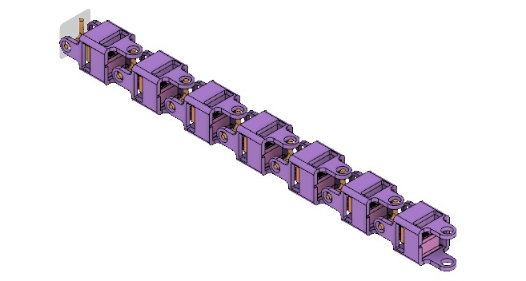
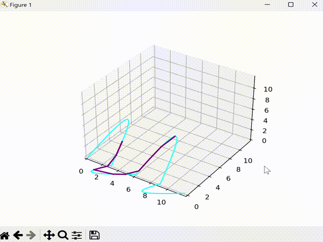

# Project SnakeBot

### Overview 

SnakeBot is a modular, wheelless robot designed by the students of Electronics and Robotics Club. It uses a series of universal joints that provide 2 degrees of freedom (DOF) at each joint. The robot is actuated with the help of strings connected to servos, which rotate each module independently in its plane.

Our project aims to explore the locomotion patterns of snakes and apply them to robotics. Initially, we are focusing on straight-line motion and navigating in the 2D plane, but we aim to implement more advanced movements in the future, such as:

- Serpentine motion
- Sidewinding motion
- Lateral motion (Barell Roll)

The long-term goal of this project is to use the frictional properties of custom designed skin, allowing it to traverse various terrains and surfaces with minimal energy loss, just like biological snakes.

### Motion

The fundamental concept behind this is using a sinosoidal wave in the x-y and y-z planes (phase shifted and one wave's amplitude encompassing another wave's) and then fitting the modular snakebot links within the bounds of this wave. This allows it to traverse in any direction based on how the wave evolves.

### PCB Designing

To give full modularity to the robot we have developed a modular, chainable PCB based on the RP2040 microcontroller. Each modular PCB consists of a power management circuit, LiPo battery connection, ability to add sensors like an IMU (MPU-6050), and controlling 2 servo motors per each module. We are planning to use serial communication between each module. 